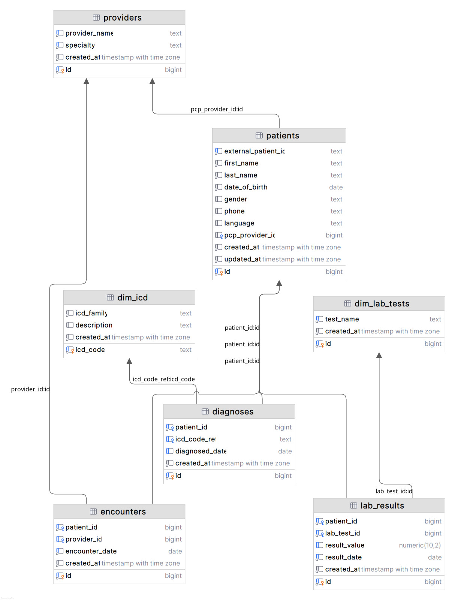

# Architecture

## Overview

Clinical Rules Engine is a data-to-worklist pipeline made of three backend services and one frontend app:

1. Ingestion Service
- Watches input data and loads normalized core tables in Postgres.
- Applies SQL migrations and idempotent upsert logic.

2. Rules Evaluation Service
- Runs program strategies (for example Diabetes Management, Primary Care Wellness).
- Stores/upserts `care.patient_evaluation` and publishes `care.patient_evaluation_needs` view.
- Produces worklist-relevant fields such as `program_name`, `specialty_need_name`, `task_type`, cadence metrics.

3. API Service
- FastAPI read layer over patient and evaluation/worklist data.
- Endpoints:
  - `GET /api/patients/`
  - `GET /api/patients/{patient_id}`
  - `GET /api/evaluation/`
  - `GET /api/evaluation/{patient_id}`

4. Web App
- React + TypeScript + Vite.
- Uses `/api/*` proxy to API service.
- Provides Dashboard, Patients, and Tasks worklist UX.

## Data Flow

1. Raw files -> ingestion service -> `core.*` tables.
2. rules-evaluation-service reads core data -> computes evaluations -> writes `care.patient_evaluation`.
3. DB view `care.patient_evaluation_needs` exposes task/worklist-ready rows.
4. api-service reads those rows and serves paginated/filterable endpoints.
5. web app renders worklists with frontend filters, pagination, and patient lookup.

## Worklist Semantics

The Tasks page is currently evaluation-row driven (not a separate task microservice):
- Clinical Team view: full backend result set.
- Scheduler view: subset where `task_type` is `Scheduling Task`.

This split is intentionally frontend-only for take-home scope.

## Operational Notes

- Compose networking keeps services private except exposed ports (`5432`, `8000`, `8080`).
- Pagination is offset/limit based.
- API currently does not return total counts; frontend infers next-page availability from page-size response length.

## Schema Design
